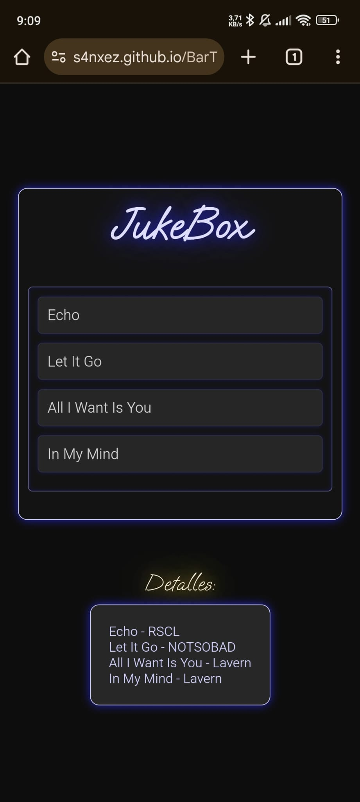

# BarTunesVote

**BarTunesVote** es una aplicación diseñada para realizar encuestas de canciones en bares, permitiendo a los usuarios votar desde sus dispositivos móviles. La canción con más votos se reproduce automáticamente mediante Spotify en el bar.

## Características principales

- **Votación en tiempo real:** Los usuarios pueden votar por sus canciones favoritas desde sus móviles.
- **Reproducción automática:** La canción ganadora se reproduce en Spotify automáticamente.
- **Integración con Spotify:** Autenticación mediante OAuth para gestionar la reproducción de canciones.
- **Conexión mediante Ngrok:** Permite establecer un dominio estático para acceder a la aplicación desde cualquier lugar.
- **Comunicación eficiente:** Uso de Websockets para actualizaciones en tiempo real de las encuestas.

---

## Tecnologías utilizadas

- **Spring Boot**: Framework para el desarrollo del servidor backend.
- **OAuth**: Protocolo de autenticación para integrar Spotify.
- **Websockets**: Comunicación en tiempo real entre los usuarios y el servidor.
- **Ngrok**: Establece un dominio estático accesible desde cualquier red.
- **Chocolatey**: Gestión de paquetes para instalar herramientas necesarias.

---

## Instalación y configuración

### Prerrequisitos

1. **Spotify Premium**: Se requiere una cuenta de Spotify Premium para la reproducción de canciones.
2. **Chocolatey**: Instala Chocolatey en el ordenador del bar para poder ejecutar Ngrok.
3. **Ngrok**: Registra una cuenta de Ngrok y solicita un dominio estático gratuito.

### Pasos de instalación

1. **Configurar Ngrok**
   - Registra una cuenta en Ngrok.
   - Solicita un dominio estático gratuito desde la página de Ngrok.
   - Guarda el dominio estático para configurar el QR del bar.

2. **Generar el código QR**
   - Usa cualquier herramienta de generación de QR (por ejemplo, [qrfy.com](https://qrfy.com/)).
   - El enlace debe seguir esta estructura:
     ```
     https://s4nxez.github.io/BarTunesVote/?server=https://dominio_estatico_de_ngrok
     ```
   - Asegúrate de no añadir una barra `/` al final del dominio, ya que esto causará errores.

3. **Ejecutar el servidor**
   - Asegúrate de que la televisión del bar esté reproduciendo una canción con la misma cuenta de Spotify que se usará en el ordenador.
   - Ejecuta Ngrok en el puerto 8080 con el dominio estático configurado.
   - Abre el archivo `.bat` para iniciar el servidor. La página de inicio de sesión se abrirá automáticamente en el navegador.
     - **Nota:** Refresca la página con `F5` o `Ctrl + R` para cargar correctamente.

4. **Configurar la página de reproducción**
   - Abre manualmente la dirección:
     ```
     http://localhost:8080/play/{id_de_la_playlist}
     ```
   - Configura esta dirección con un ID de playlist inicial y guárdala en favoritos.
     - Ejemplo: Si el ID de la playlist es `37i9dQZF1DX1HCSfq0nSal`, la dirección será:
       `http://localhost:8080/play/37i9dQZF1DX1HCSfq0nSal`
   - Una vez configurada, solo será necesario modificar el contenido de la playlist directamente desde Spotify.

5. **Verificar el funcionamiento**
   - Escanea el código QR desde un móvil para verificar que la lista de canciones se carga correctamente.
   - Confirma que los votos impactan en la selección de canciones y que estas se reproducen automáticamente.

---

## Uso

1. Usuarios escanean el código QR en el bar.
2. Votan por sus canciones favoritas desde sus móviles.
3. La canción con más votos se reproduce automáticamente en la televisión del bar mediante Spotify.

---

## Capturas de pantalla

A continuación, se incluye una captura de pantalla de la interfaz móvil para que puedas visualizar cómo los usuarios interactúan con la aplicación:



---

## Contribuciones

Actualmente, este proyecto no acepta contribuciones externas.

---

## Licencia

Este proyecto está bajo una licencia personalizada. Para más información, contacta con el autor.

---

**¡Gracias por usar BarTunesVote!**
